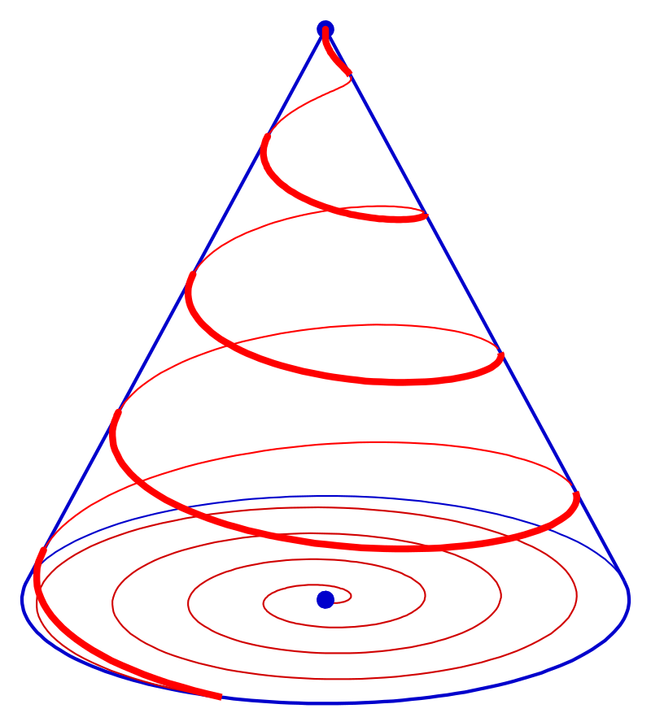
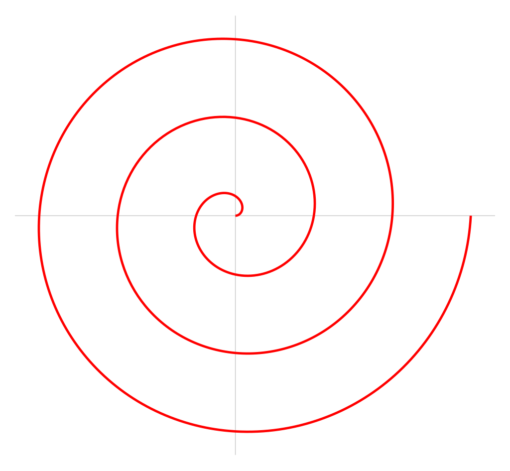

# Understand the decoration of Christmas Tree geometrically

 →

## 1. Christmas Tree

A Christmas tree can be taken as a [cone](https://en.wikipedia.org/wiki/Cone):

where:

- $r$: the radius of the base of the tree.
- $h$: the height of the tree.
- $c$: the tree's slant height.
- $\theta$: the angle which the base expands from the center at the top.

The area of the base is:

$$
A_{\text{base}} = \pi r^2
$$

The surface area of the cone is:

$$
A = \pi r(r + \sqrt{h^2 + r^2})
$$

The volume of the cone is: 

$$
V = \pi r^2 \dfrac{h}{3}
$$

## 2. Decoration

We know that the surface area of the cone is:

$$
A = \pi r (r + \sqrt{h^2 + r^2})
$$

This is from the formula:

$$
A = \pi r^2 + \pi rc
$$

Which is the sum of the base area and the lateral surface area:

We know that c can be calculated from r and h, using [Pythagorean theorem](https://en.wikipedia.org/wiki/Pythagorean_theorem):

$$
\begin{equation}
\begin{split}
c^2 &= h^2 + r^2 \\
c   &= \sqrt{h^2 + r^2}
\end{split}
\end{equation}
$$

So:

$$
\begin{equation}
\begin{split}
A &= \pi r^2 + \pi rc \\
  &= \pi r(r + c) \\
  &= \pi r(r + \sqrt{h^2 + r^2})
\end{split}
\end{equation}
$$

Suppose we want to add decoration items around the tree.

We want to cover the area equally e.g. there are at least $d$ items per square meter.

But note that we don't do decoration on the area beneath the base of the tree.

So the area that we would do decoration is:

$$
\begin{equation}
\begin{split}
AD &= \pi rc \\
   &= \pi r(\sqrt{h^2 + r^2})
\end{split}
\end{equation}
$$

The number of items required is:

$$
\begin{equation}
\begin{split}
N &= d \cdot AD \\
  &= d \pi r( \sqrt{h^2 + r^2}) 
\end{split}
\end{equation}
$$

## 3. Light String

Suppose we have a light string and wrap it around the tree:

The floor projection of the light string is of the form:

This is known as a [Archimedean spiral](https://en.wikipedia.org/wiki/Archimedean_spiral).

And the structure is known as [Conical Spiral (or Conical Helix)](https://en.wikipedia.org/wiki/Conical_spiral).

## 4. Coordinates of Light String

On a 3D plane, the coordinates of the light string are given by the [parametric equations](https://en.wikipedia.org/wiki/Conical_spiral#Parametric_representation):

$$
\begin{equation}
\begin{split}
x &= r(\phi) \ \cos \ \phi \\
y &= r(\phi) \ \sin \ \phi \\
z &= z
\end{split}
\end{equation}
$$

where:
- $x, y, z$: the Cartesian coordinates of the spiral (light string) in 3D space.
- $\phi$: the polar angle in the $xy$ plane which is a function of $z$ i.e. $\phi = \phi(z)$.
- $r(\phi)$: the radius of the spiral in the $xy$ plane at height $z$.
- $h$: the height of the tree.

**Note:** In the diagram, $r(\phi)$ is denoted by $p$ (i.e. $r(\phi) \equiv p$).

### Radius Function
  
Since the spiral’s radius decreases linearly as the height $z$ increases, we have:

$$
r(\phi) = p(z) = \frac{h-z}{h}r
$$

So the equations become:

$$
\begin{equation}
\begin{split}
x &= \frac{h-z}{h}r \ \cos  \ \phi \\
y &= \frac{h-z}{h}r \ \sin \ \phi \\
z &= z
\end{split}
\end{equation}
$$

### Angular Frequency

We assume the light string wraps around the cone at a constant angular rate with respect to height:

$$
\frac{d\phi}{dz} = a
$$

where $a$ is the [angular frequency](https://en.wikipedia.org/wiki/Angular_frequency) (radians per unit height).

Integrating from the base ($z=0$) to height $z$:

$$
\begin{equation}
\begin{split}
\phi = \phi(z) &= \int_{0}^{z} \dfrac{d\phi}{dz} dz \\
&= \int_{0}^{z} a \ dz \\
&= a \int_{0}^{z} dz \\
&= a \big[ z \big]_{0}^{z} \\
&= a (z - 0) \\
&= az
\end{split}
\end{equation}
$$

So the parametric equations become:

$$
\begin{equation}
\begin{split}
x &= \frac{h-z}{h}r \ \cos(az) \\
y &= \frac{h-z}{h}r \ \sin(az) \\
z &= z
\end{split}
\end{equation}
$$

### Final Parametric Equation

The light string makes exactly $n$ turns from the base to the top of the tree:

- At $z=0$:  

$$
\phi(0) = 0
$$

- At $z=h$:  

$$
\phi(h) = ah
$$

Each complete turn corresponds to $2\pi$ radians ($360^\circ$). After $n$ turns at the top:

$$
\phi(h) = ah = 2\pi n
$$

So:

$$
a = \frac{2\pi n}{h}
$$

Therefore, we obtain the final parametric equations:

$$
\begin{equation}
\begin{split}
x &= \frac{h-z}{h}r \ \cos\  \frac{2\pi n z}{h} \\
y &= \frac{h-z}{h}r \ \sin \ \frac{2\pi n z}{h} \\
z &= z
\end{split}
\end{equation}
$$

where:
- $n$: the number of turns (wraps) of the spiral from base to top.

### 3d Graph
A graph of this conical spiral in 3d space is available at:
[https://www.desmos.com/3d/b3rwhcv8qi](https://www.desmos.com/3d/b3rwhcv8qi)

## 5. Length of Light String

The formula to calculate the [arc length](https://mathworld.wolfram.com/ConicalSpiral.html) of a conical spiral is:

$$
\begin{equation}
L = S(t) = \dfrac{1}{2}t\sqrt{1 + r^2(1 + a^2t^2)} + \dfrac{1 + r^2}{2ar} \sinh^{-1} \left( \dfrac{art}{\sqrt{1 + r^2}} \right)
\end{equation}
$$

where:
- $a$: the angular frequency of the spiral.
- $t$: time - a parameter that traces out the spiral. As $t$ increases from 0, we move along the spiral path.

It's the closed form solution to the arc length's [general formula](https://en.wikipedia.org/wiki/Conical_spiral#Arclength):

$$
\begin{equation}
L = \int_{0}^{t} \sqrt{\left(\dfrac{dx}{dz}\right)^2 + \left(\dfrac{dy}{dz}\right)^2 + \left(\dfrac{dz}{dz}\right)^2} \ dt
\end{equation}
$$

where $z = t$.

or in our case:

$$
\begin{equation}
L = \int_0^h \sqrt{\left(\dfrac{dx}{dz}\right)^2 + \left(\dfrac{dy}{dz}\right)^2 + \left(\dfrac{dz}{dz}\right)^2} \ dz
\end{equation}
$$

Apply the closed form solution to our case, where $t = h$ and $a = \dfrac{2\pi n}{h}$:

$$
\begin{equation}
\begin{split}
L &= \dfrac{1}{2}h\sqrt{1 + r^2(1 + \left(\dfrac{2\pi n}{h}\right)^2h^2)} + \dfrac{1 + r^2}{2\left(\dfrac{2\pi n}{h}\right)r} \sinh^{-1} \left( \dfrac{\left(\dfrac{2\pi n}{h}\right)rh}{\sqrt{1 + r^2}} \right) \\
  &= \dfrac{h}{2}\sqrt{1 + r^2 \left(1 + \dfrac{(2\pi n)^2}{h^2} h^2\right)} + \dfrac{h(1 + r^2)}{4\pi nr} \sinh^{-1}\dfrac{2\pi nr}{\sqrt{1 + r^2}} \\
  &= \dfrac{h}{2}\sqrt{1 + r^2(1 + (2\pi n)^2)} + \dfrac{h(1 + r^2)}{4\pi nr} \sinh^{-1}\dfrac{2\pi nr}{\sqrt{1 + r^2}}
\end{split}
\end{equation}
$$

And so the final solution to the arc length of the spiral is:

$$
\begin{equation}
L = \dfrac{h}{2}\sqrt{1 + r^2(1 + (2\pi n)^2)} + \dfrac{h(1 + r^2)}{4\pi nr}\sinh^{-1}\dfrac{2\pi nr}{\sqrt{1 + r^2}}
\end{equation}
$$

## 6. Example

Suppose we have a Christmas tree with:
- Height: $h = 2m$
- Base radius $r = 0.25m$

We want to have decoration density:
- $d = 7 \ items/m^2$

And we want to wrap the light string:
- $n = 5$ times

Number of decorate items needed:

$$
\begin{equation}
\begin{split}
N &= d \pi r(\sqrt{h^2 + r^2}) \\
  &= 7 \cdot \pi \cdot 0.25 (\sqrt{2^2 + 0.25^2}) \\
  &= 7 \cdot 1.58302060708m^2 \\
  &= 11.0811442496 \approx 11 \ items
\end{split}
\end{equation}
$$

The length of the light string would be:

$$
\begin{equation}
\begin{split}
L &= \dfrac{h}{2}\sqrt{1 + r^2(1 + (2\pi n)^2)} + \dfrac{h(1 + r^2)}{4\pi nr}\sinh^{-1}\dfrac{2\pi nr}{\sqrt{1 + r^2}} \\
  &= \dfrac{2}{2}\sqrt{1 + 0.25^2(1 + (2\pi \cdot 5)^2)} + \dfrac{2(1 + 0.25^2)}{4\pi \cdot 5 \cdot 0.25}\sinh^{-1}\dfrac{2\pi \cdot 5 \cdot 0.25}{\sqrt{1 + 0.25^2}} \\
  &= \sqrt{62.7475275068} + \dfrac{2.125}{15.7079632679} \cdot \sinh^{-1}\dfrac{7.85398163397}{1.0307764064} \\
  &= 7.92133369495 + 0.13528170162 \cdot 2.72813 \\
  &= 7.92133369495 + 0.36906606864 \\
  &= 8.29039976359 \approx 8.3m
\end{split}
\end{equation}
$$

## 7. Conclusion

Given a Christmas tree and:
- Its base's radius $r$.
- Its height $h$.
- The number of rounds of the light string $n$ that is required.

We can calculate the area and volume of the tree. We can also calculate the number of decorate items needed to cover the tree, and determine the exact coordinates that the string will travel through. Finally, we can also calculate the exact length of the light string.

In conclusion:

