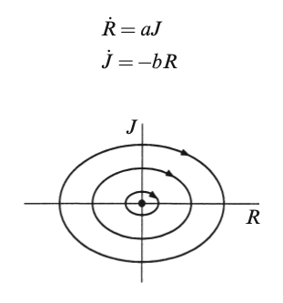

# Fun: Love as a Dynamical System & Forecasting Relationships

## Love As A Dynamical System

Steven H. Strogatz first proposed a linear system in his book [Nonlinear Dynamics and Chaos: With Applications to Physics, Biology, Chemistry and Engineering](https://books.google.com.vn/books/about/Nonlinear_Dynamics_and_Chaos.html?id=1wrsEAAAQBAJ&source=kp_book_description&redir_esc=y):

$$
\begin{cases}
\dfrac{dR}{dt} = aJ \\
\dfrac{dJ}{dt} = -bR
\end{cases}
\quad \text{with } a, b > 0
$$

Here, $R$ and $J$ represent Romeo and Juliet, respectively.
- Unlike the classical play, in his version of the story (his own circumstance with his girl friend as he admitted), as Juliet's love increases, it accelerates Romeo's love: ($\dfrac{dR}{dt} = aJ$), but the opposite happens for Juliet ($\dfrac{dJ}{dt} = -bR$): as Romeo loves Juliet more, she pulls away from him.
- This system can lead to oscillatory or unstable behavior, depending on the parameters.

A phase portrait of such system shows that this results in a never ending circle of love and hate between the pair, where they only love each other only 1/4 of the time (i.e. when both $R, J > 0$).

This is a fun example of modeling love as a dynamical system using differential equations. Such models can be extended or modified to represent more complex relationship dynamics.

## Generalization

We can consider the more general system:

$$
\begin{cases}
\dfrac{dR}{dt} = aR + bJ \\
\dfrac{dJ}{dt} = cR + dJ
\end{cases}
$$

This is a linear system with matrix form:

$$
\dfrac{d}{dt}
\begin{bmatrix}
R \\ J
\end{bmatrix}
\begin{bmatrix}
a & b \\
c & d
\end{bmatrix}
\begin{bmatrix}
R \\ J
\end{bmatrix}
$$

The dynamics depend on the eigenvalues of the coefficient matrix:

$$
A = \begin{bmatrix}
a & b \\
c & d
\end{bmatrix}
$$

Spiral sinks/sources, nodes, saddles, or centers can all emerge, depending on:
  -	Trace: $\tau = a + d$
  -	Determinant: $\Delta = ad - bc$
  -	Discriminant: $\tau^2 - 4\Delta$

### Romantic Archetypes Based on Signs of $a$ and $b$

Consider Romeo’s equation:

$$
\dfrac{dR}{dt} = aR + bJ
$$

- $a > 0$: Romeo is self-encouraging—gets more excited by his own love.
- $a < 0$: Romeo is self-doubting—his own love overwhelms or discourages him.
-	$b > 0$: Romeo is reactive to Juliet’s love (positive feedback).
-	$b < 0$: He is repelled by Juliet’s attention (negative feedback).

Similarly for Juliet:

$$
\dfrac{dJ}{dt} = cR + dJ
$$

Same idea: signs of $c$ and $d$ define her archetype.

**General archetypes can be summarized in this table:**

| name | $a$ or $d$ | $b$ or $c$ | description |
|---|---|---|---|
| Eager Beaver | > 0 | > 0 | Reponds strongly to other's affection and their own feelings. Explosive lover. |
| Cautious Lover | < 0 | > 0 | Encouraged by other's love but represses their own feelings. |
| Hermit | < 0 | < 0 | Withdraws from both their own and other's feelings. |
| Contrarian | > 0 | < 0 | Gains confidence when other ignores them. |

<!-- ## Phase Portraits

What happens if the pair gets together ? -->

<!-- 

 -->

## Extensions

### 1. Rhett and Scarlett - Gone with the Wind
[Rinaldi et al. (2013) in their essay: *A mathematical model of "Gone with the Wind"*](https://www.researchgate.net/publication/257219064_A_mathematical_model_of_Gone_with_the_Wind) proposed a model on the love story between Scarlett O'Hara and Rhett Butler from "Gone with the Wind":

$$
\begin{cases}
\dfrac{dx_1(t)}{dt} = -\alpha_1x_1(t) + \rho_1A_2 + R_1(x_2) \\
\dfrac{dx_2(t)}{dt} = -\alpha_2x_2(t) + \rho_2A_1 + R_2(x_1)
\end{cases}
$$

where:

$$
A_i = \sum_{h}\lambda^h_jA^h_i
$$

This is the appeal of an individual $i$ to individual $j$. It can be composed of various components $A^h_i$ such as physical attractiveness, intelligence etc. which are independent on the feeling $x_i$ for the partner. 

This is perceived by individual $j$ as shown by the coefficient $\lambda^h_j$.

Then we have:

$$
R_i(x_j) = k_ix_jexp(-x_j/\beta_i)
$$

This show that the lover's reactions first increase with the love of the partner and then decrease. Individuals of this kind are called insecure, or, sometimes, refusers, because they react less and less strongly when the love of the partner exceeds a certain threshold. 

This can be simplified and understood as:

$$
\begin{cases}
\dot{R} = -R + AS + kSe^{-S} \\
\dot{S} = -S + AR + kRe^{-R}
\end{cases}
$$

where:

- $R$: Rhett's love for Scarlett.
- $S$: Scarlett's love for Rhett.

The equations shows that:
- Both Rhett and Scarlett are cautious lovers, as shown by the terms $-R$ and $-S$. The more Scarlett loves, the more she pulls back and the more Rhett loves, the more he pulls back.
- The exponential terms $kSe^{-S}$ and $kSe^{-R}$ describe how the lovers react to each other. The negative exponents cause the function to have a maximum i.e. when Scarlett loves Rhett to a certain level, the love begins to have less effect on him and vice versa.
- In this regard, we can see the terms $AR$ and $AS$ as the minimum amount of love that one will always have for the other. 

### 2. Darcy and Elizabeth - Pride and Prejudice

Again, [Rinaldi et al. (2014) in the essay: *A Mathematical Model of "Pride and Prejudice"*](https://www.researchgate.net/publication/260373742_A_Mathematical_Model_of_Pride_and_Prejudice) further extends this model to introduce "lover's memories":

$$
\begin{cases}
\dfrac{dx_1(t)}{dt} = -\alpha_1x_1(t) + \rho_1A_2 + R_1(x_2) \\
\dfrac{dx_2(t)}{dt} = -\alpha_2x_2(t) + \rho_2A_1 + R_2(x_1)
\end{cases}
$$

where $\dot{x_1}$ represents Darcy's love for Elizabeth as it progresses over time and $\dot{x_2}$ represents Elizabeth's love for Darcy as it progresses over time.

This is similar to the model introduced to describe Scarlett and Rhett from *"Gone with the Wind"* where:

$$
A_i = \sum_{h}\lambda^h_jA^h_i
$$

describes the attractiveness (appeal) of individual $i$ to individual $j$. It's not an absolute character of the individual, but rather a value perceived by his/her partner. As such, the appeal $A_i$ of individual $i$ varies discontinuously each time the partner $j$ discovers some relevant hidden aspect of the character of $i$.

The difference this time is in the terms $R_1(x_2)$ and $R_2(x_1)$ where they are described as:

$$
R_{1}(x_2) = \dfrac{e^{x_2} - e^{-x_2}}{e^{x_2} / R^{+}_{1} - e^{-x_2} / R_1^-}
$$

$$
R_{2}(x_1) = \dfrac{e^{x_1} - e^{-x_1}}{e^{x_1} / R^{+}_{2} - e^{-x_1} / R_2^-}
$$

with:
- $R^{+}_{1} = 2$
- $R^{+}_{2} = 1$
- $R_1^- = R_2^- = -1$

This reflects the most standard individuals, often called secure. They are those who like to be loved. An individual $i$ belonging to this class is formally characterized by an increasing function $R_i(x_j)$ that identifies the flow of interest generated in individual $i$ by the love $x_j$ of the partner.

The authors do not explain why these values
were chosen, but it is likely that $R_1^+$ and $R_2^+$ signify how lovers respond to positive love from the other. From the story, Darcy reacts more positively to Elizabeth's love compare to Elizabeth's somewhat "more chill" attitude.

In the same way $R_1^-$ and $R_2^-$ represent how the characters respond when the other is disinterested.

Finally, the coefficient $\alpha$ indicates the rate of which individuals lose memories of their partner after separating. The authors set:

$$
\alpha_{1} = 0.1
$$

$$
\alpha_{2} = 0.3
$$

This reflects the story where Elizabeth's initial negative impression of Darcy was forgotten and later allowed her affection to increase.

So the system for Darcy and Elizabeth is:

$$
\begin{cases}
\dot{D} = -\alpha_{D} D + \rho_{D} A_{E} + \dfrac{e^{E} - e^{-E}}{e^{E} / R_D^+ - e^{-E} / R_D^-} \\
\dot{E} = -\alpha_{E} E + \rho_{E} A_{D} + \dfrac{e^{D} - e^{-D}}{e^{D} / R_E^+ - e^{-D} / R_E^-}
\end{cases}
$$

where:
- $\alpha$: forgetting coefficient, indicating the rate of which individuals lose memories of their partner after separating.
- $A_{E}$: Elizabeth's appeal to Darcy.
- $A_{D}$: Darcy's appeal to Elizabeth.
- $\rho_{D}$: sensitivity of Darcy character to the appeal of Elizabeth.
- $\rho_{E}$: sensitivity of Elizabeth character to the appeal of Darcy.
- $D$: Darcy's love for Elizabeth.
- $E$: Elizabeth's love for Darcy.

with values:

- $\alpha_{D} = 0.1$
- $\alpha_{E} = 0.3$
- $R^{+}_{D} = 2$
- $R^{+}_{E} = 1$
- $R_D^- = R_E^- = -1$

### 3. Time delay and chaos in love dynamics

[Son et al. - Time Delay Effect on the Love Dynamical Model (2011)](https://arxiv.org/abs/1108.5786) generalized Rinaldi's model, in which the derrivative of an individual's love is the sum of 3 sub-functions:

- Oblivion process $O_i$,
- Return $R_i$
- Instinct $I_i$

It's defined as:

$$
x_i(t) = O_i(x_i(t)) + R_i(x_j(t)) + I_i(x_i(t))
$$

For each term:

$$
O_i(x_i) = − \alpha_i xi
$$

Describes the Oblivion process, with $\alpha > 0$ is the forgetting coefficient.

Then the return $R_i$ is the reaction of individual $i$ to the partner's love $x_j$. There are:
- Linear return (general model - Romeo & Juliet)
- Non-secure return (Rhett & Scarlett)
- Secure return (Darcy & Elizabeth)

Finally, the Instinct $I_i$ is related to the reaction of an individual $i$ to their partner's appeal $A_j$.

Authors went further and introduce the concepts of synergic and non-synergic instincts:

| Type | Function |
|---|---|
| Non-synergic | $I_i^n = \gamma_iA_j$ |
| Synergic | $I_i^s = (1 + S_i(x_i))\gamma_iA_j$ |

where:

$$
S_i(x_i) =
\begin{cases}
\sigma_i x_i^8 / (1 + x_i^8) \quad \text{for } x_i \ge 0 \\ 
0 \qquad \qquad \qquad \ \text{for } x_i < 0
\end{cases}
$$

This can be explained as when the synergic instinct is considered, the individual’s reaction to the partner’s appeal can be enhanced by love. For example, mothers often have a biased view of the beauty of their children. The authors also assumed that lovers are "civillized" as synergic has no effect (i.e. 0) when their love is negative.

Now the authors went a step further and introduce the concept of time delay:

- How does an individual know the partner’s romantic feeling? In a real situation, the romantic interaction is mediated by communication, e.g., a talk, a phone call, an email, a letter, etc. That is, time is required for the romantic feelings of someone to transfer to the other.

- Also, [Ackerman et al. - Let’s Get Serious: Communicating Commitment in Romantic Relationships](https://assets.csom.umn.edu/assets/165677.pdf) showed that an individual could delay one’s confessing love to adjust potential costs and benefits.

So they concluded that the oblivion, the return, and the instinct do not proceed simultaneously, and the delay time $\tau$ was added to the return function:

$$
\dot{x_i}(t) = O_i(x_i(t)) + R_i(x_j(t − \tau_j)) + I_i(x_i(t))
$$

So the original system as shown in *"Gone with the Wind"* and *"Pride and Prejudice"*:

$$
\begin{cases}
\dot{x_1}(t) = -\alpha_1x_1(t) + \rho_1A_2 + R_1(x_2) \\
\dot{x_2}(t) = -\alpha_2x_2(t) + \rho_2A_1 + R_2(x_1)
\end{cases}
$$

can be updated as:

$$
\begin{cases}
\dot{x_1}(t) = O_1(x_1(t)) + I_1(x_1(t)) + R_1(x_2(t - \tau_2))  \\
\dot{x_2}(t) = O_2(x_2(t)) + I_2(x_2(t)) + R_2(x_1(t - \tau_1))
\end{cases}
$$

The authors then perform [Hopf Bifurcation](https://en.wikipedia.org/wiki/Hopf_bifurcation) analysis and proved that:

- If neither partner exhibits a non-secure return (i.e. both have secure or linear returns), the steady state remains stable regardless of time delays, for both synergic and non-synergic couples.
- If at least one partner has a non-secure return, time delays can destabilize the steady state, leading to a Hopf bifurcation and cyclic love dynamics (periodic emotional oscillations).

The numerical bifurcation analysis shows that:
- The bifurcation results in chaotic motion, which exhibits stormy patterns of feelings and a long-time unpredictable state.
- For an "insensitive couple" (likely referring to partners with low emotional responsiveness or weak mutual influence), the time delay does not affect the steady state.

In short, Son et al. (2011) conclude that time delays in romantic interactions can significantly influence relationship dynamics, particularly when one or both partners exhibit emotionally reactive (non-secure) behaviors. Stable, secure couples can weather delays without disruption, while reactive couples risk cyclic or chaotic emotional patterns. For insensitive couples, delays have minimal impact, but their relationships may lack emotional depth.

This can be applied beyond romantic relationships to a broader range of interactions, such as those between friends, family members, employers and employees, or other relationships.

### 3. The effect of Parents, Friends and Family on the dynamics of Love